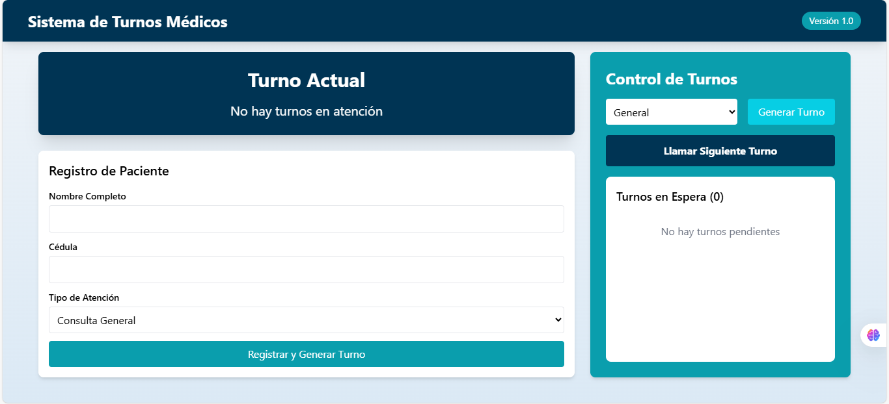

### Sistema de Gestión de Turnos Virtuales 🏥

Interfaz principal del sistema de turnos

## 📋 Descripción

Sistema web para la gestión de turnos en consultorios médicos, desarrollado con:

* Frontend: React + Vite + Tailwind CSS

* Almacenamiento: IndexedDB (persistencia local)

* Estilos: Tailwind CSS con paleta de colores médicos (#0A9EAD, #07CEE4, #003454)

## ✨ Características principales

* 🚀 Generación automática de turnos con 3 categorías:

    1. General
    2. Prioritario (adultos mayores/embarazadas)
    3. Retiro de exámenes

* 📌 Pantalla pública con temporizador de atención

* 🔔 Notificaciones visuales para turnos próximos

* 💾 Persistencia de datos sin necesidad de backend

* 📱 Diseño 100% responsive

## 🛠 Estructura del proyecto

├── public/                  # Assets públicos
├── src/
│   ├── assets/              # Imágenes/iconos
│   ├── components/          # Componentes React
│   │   ├── Cabecera.jsx     # Barra de navegación
│   │   ├── ColaTurnos.jsx   # Listado de turnos
│   │   ├── FormularioTurno.jsx  # Registro de pacientes
│   │   ├── Notificacion.jsx # Componente de alertas
│   │   ├── PanelControl.jsx # Interfaz administrativa
│   │   └── PantallaPublica.jsx  # Display de turno actual
│   │
│   ├── hooks/
│   │   └── useTurnos.js     # Lógica de gestión de turnos
│   │
│   ├── services/
│   │   └── almacenamiento.js # Conexión con IndexedDB
│   │
│   ├── App.jsx              # Componente principal
│   ├── index.css            # Estilos base
│   └── main.jsx             # Punto de entrada
│
├── .gitignore
├── eslint.config.js         # Configuración de ESLint
├── index.html
├── package.json
├── postcss.config.js
├── tailwind.config.js       # Config Tailwind
└── vite.config.js           # Config Vite

## 🚀 Instalación y uso

1. Clonar repositorio:

git clone [url-del-repositorio]
cd nombre-del-proyecto

2. Instalar dependencias:

npm install

3. Ejecutar en desarrollo:

npm run dev
4. Construir para producción:

npm run build

## 🎨 Paleta de colores

Primary	#0A9EAD	Botones principales
Secondary	#07CEE4	Elementos destacados
Dark	#003454	Cabecera y textos
Light	#FFFFFF	Fondos

## 📌 Funcionalidades clave

Generación de turnos

// Ejemplo de estructura de turno
{
  id: 123456789,
  numero: 5,
  categoria: "prioritario",
  timestamp: "2025-03-25T12:00:00Z",
  atendido: false,
  paciente: {
    nombre: "María González",
    cedula: "V-12345678"
  }
}

## Flujo de atención

1. Recepción registra paciente

2. Sistema asigna turno automático

3. Pantalla muestra turno actual

4. Temporizador de 3 minutos por consulta

5. Notificación a 1 minuto del cambio

## 💡 Tecnologías utilizadas

React -	Biblioteca frontend
Vite - Bundler y servidor dev
Tailwind CSS - Framework CSS
IndexedDB -	Base de datos local
Framer Motion - 10.0.0	Animaciones
